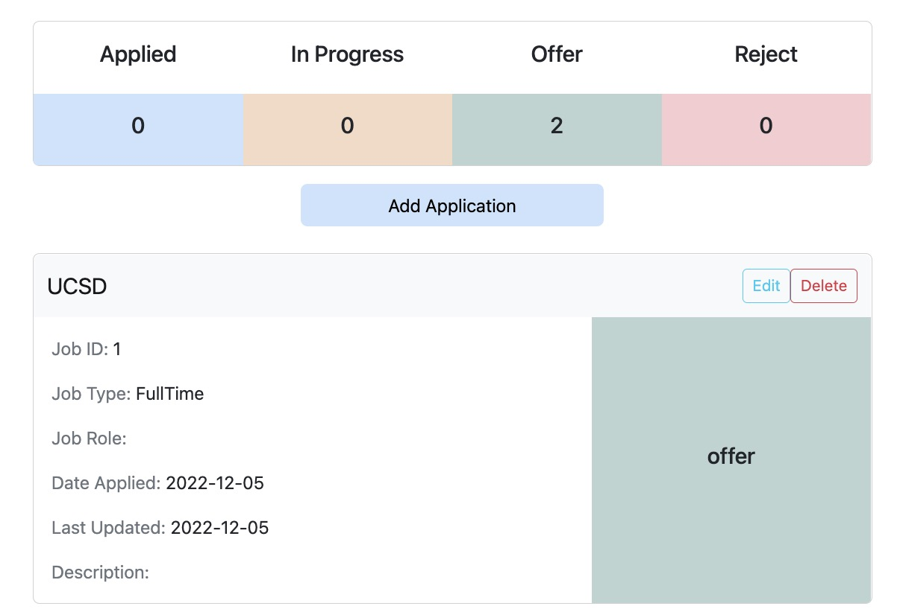

# AppTrak (CSE210_Group6)

## Introduction
<strong>AppTrak</strong> - A local first and single-user web app that saves us from the excel sheet management mess and allows us to declutter our application tracking and make it easier. 



The reason we develop it is that students from various fields of study apply for internships and jobs every year. However, keeping track of the applications and their status gets cumbersome in an Excel sheet. It results in students abandoning their efforts to keep track of their progress, often leading to missed deadlines and poor planning. This overall hinders the student learning experience and adds to their frustration.

## Features of AppTrak
- The user can create a new event in the calendar.
- The user can view already created events in the calendar.
- The user can delete an existing event in the calendar.
- The user can update an existing event in the calendar.

The application is local first: when the Internet does not work, events can be read, created, deleted, updated through the application

## Technology Architecture (Need to be checked)


## Database Design
- Each record is uniquely identified by an auto-incrementing integer key defined as "Card Id".
- Duplicate entries for a job are allowed. This is done to relax the mandatory constraint of having to enter jobId which is an overhead for an end user.

| Name      | Type | Mandatory | Max chars | Default |
| ----------- | ----------- | ----------- | ----------- |----------- |
| Card Id     | Alphanumeric       | Y(Primary Key)       | 200 chars       | |
| Job Id      | Alphanumeric       | N       | 200 chars       | |
| Company Name   | String        | Y        | 200 chars        | |
| Date   | Date        | Y       | NA       |  |
| Last Updated Date   | Date        | Automatic-System Date        | NA       | 
| Job Type   | Enum  (FullTime, PartTime, Internship)      | N        |        |FullTime |
| Job Role   | String        | N        | 500 chars        | |
| Status   | Enum (Applied, InProgress, Offer, Reject)       | N        |        | Applied|
| Description   | String      | N        | 5000 chars       | |

## Testing Strategies

## Coding standards
- Each functions should have inline comment
- Each function and variable should named using Camel case
- Use VSCode
- Install the VSCode extension for ESLint to help lint your code
- Use the following format for naming git branches:
  - uthor_name/feature_description
  - E.g., ripunjay/configure_jsdocs

## Steps to Run the Project
1. Clone this project (or a fork of this project)

    ```git clone https://github.com/r4sharma/CSE210_Group6.git```

2. Open the repository in a terminal

    ```cd CSE210_Group6 ```

3. Install node modules

    ```npm install```

4. Build the project

    ```npm run build```

5. Start the application by opening dist/index.html in a browser

6. Repeat step 4 after any changes to the application

7. To run unit tests the application

    ```npm run test```

8. To run integration tests the application

    ```python e2e_testing/integration.py```

## Relevant Documents
- ADR                                       
  - [AsynchronousCodeStrategy](https://github.com/r4sharma/CSE210_Group6/blob/dev/Docs/ADR/AsynchronousCodeStrategy.md)
  - [Database](https://github.com/r4sharma/CSE210_Group6/blob/dev/Docs/ADR/Storage.md)
  - [DatabaseTesting](https://github.com/r4sharma/CSE210_Group6/blob/dev/Docs/ADR/DatabaseTesting.md)
  - [UITesting](https://github.com/r4sharma/CSE210_Group6/blob/dev/Docs/ADR/UITesting.md)
  - [Webpack](https://github.com/r4sharma/CSE210_Group6/blob/dev/Docs/ADR/Webpack.md)
  - [GitWorkflow](https://github.com/r4sharma/CSE210_Group6/blob/dev/Docs/ADR/GitWorkflow.md)
- Developing Guildline              
  - [branch-merge](https://github.com/r4sharma/CSE210_Group6/blob/dev/Docs/guidelines/branch-merge.md)
  - [coding-conventions](https://github.com/r4sharma/CSE210_Group6/blob/dev/Docs/guidelines/coding-conventions.md)
  - [git-conventions](https://github.com/r4sharma/CSE210_Group6/blob/dev/Docs/guidelines/git-conventions.md) 
  - [project-management](https://github.com/r4sharma/CSE210_Group6/blob/dev/Docs/guidelines/project-management.md) 
- Meeting Notes
  - [Sprint 1](https://github.com/r4sharma/CSE210_Group6/tree/dev/Docs/meeting-notes/Sprint%201)
  - [Sprint 2](https://github.com/r4sharma/CSE210_Group6/tree/dev/Docs/meeting-notes/Sprint%202)
  - [Sprint 3](https://github.com/r4sharma/CSE210_Group6/tree/dev/Docs/meeting-notes/Sprint%203)
  - [Sprint 4](https://github.com/r4sharma/CSE210_Group6/tree/dev/Docs/meeting-notes/Sprint%204)
  - [Sprint 5](https://github.com/r4sharma/CSE210_Group6/tree/dev/Docs/meeting-notes/Sprint%205) 
